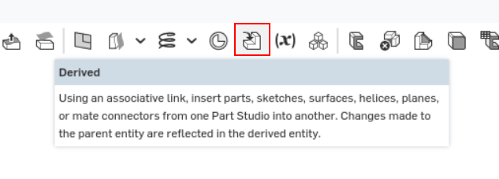
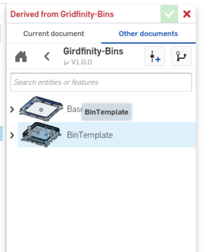
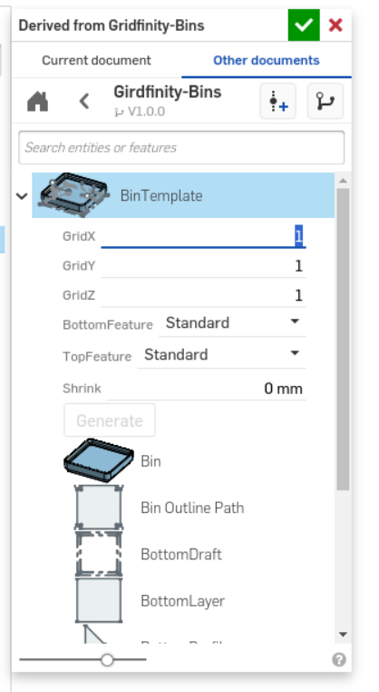
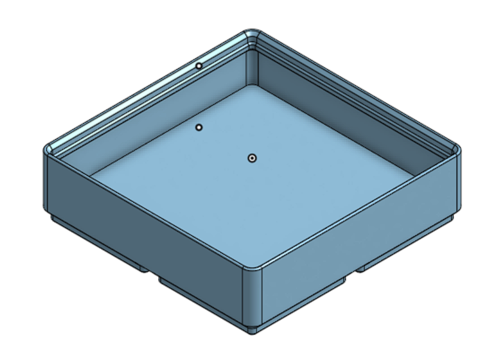
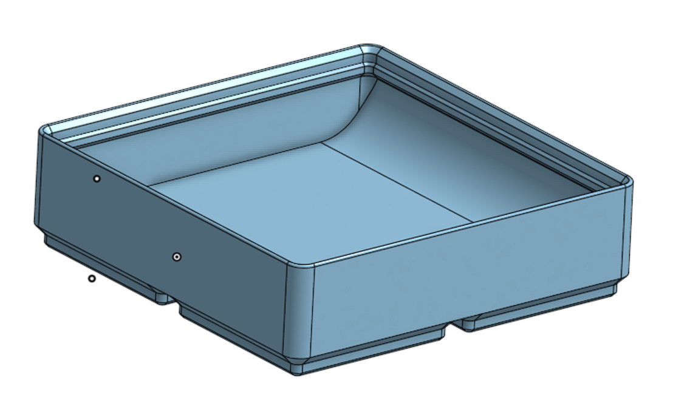
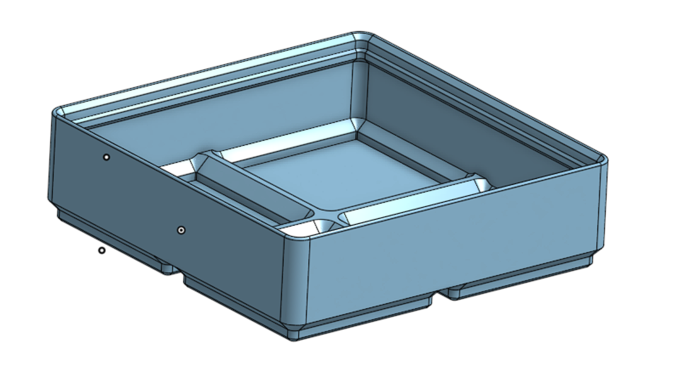
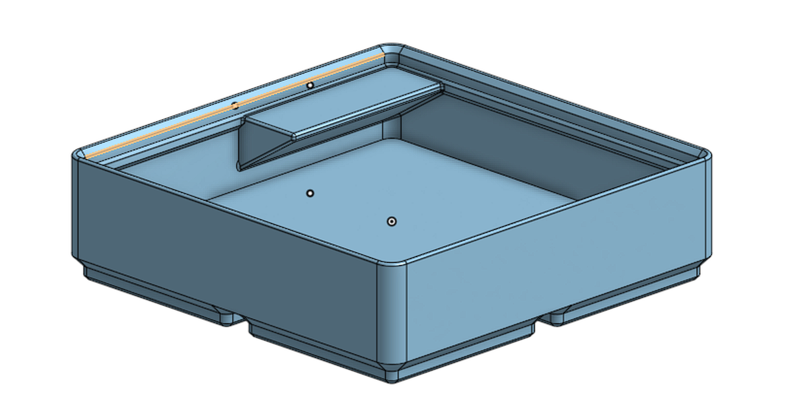
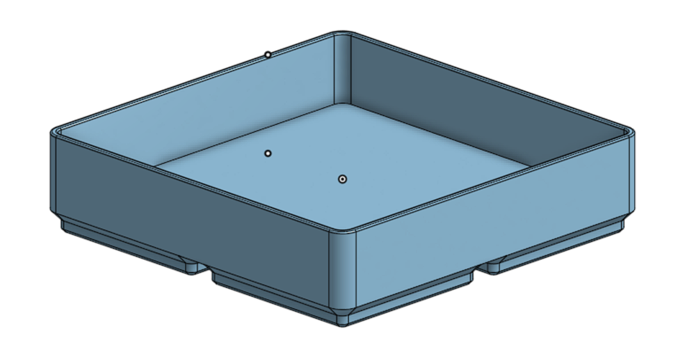
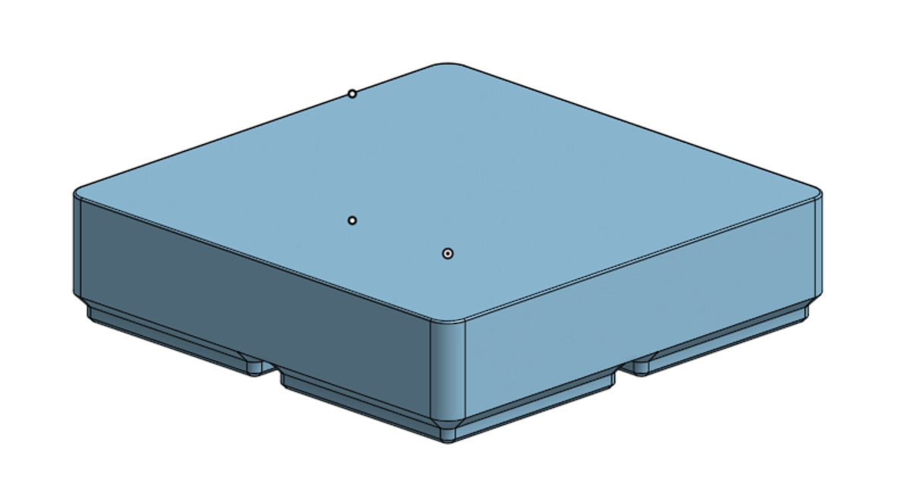
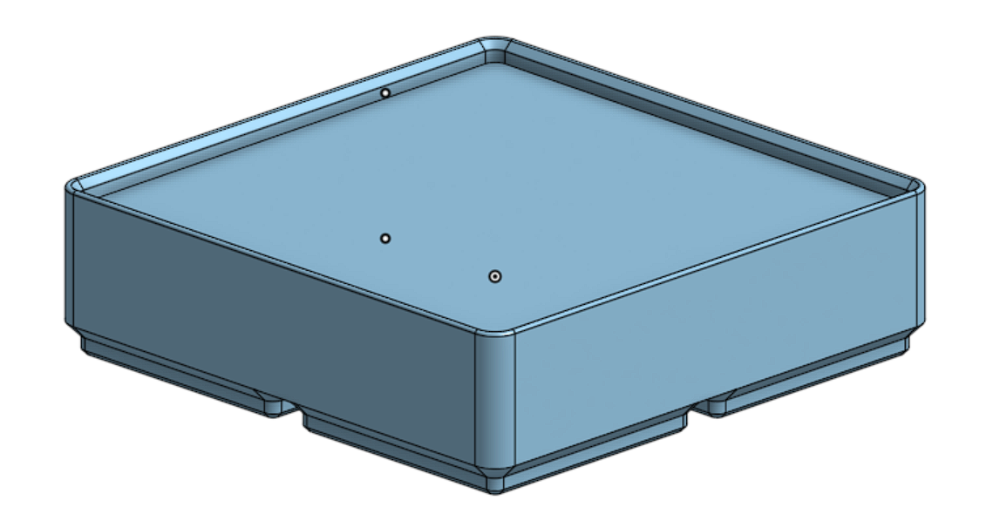

# onshape-gridfinity

## How To use

Create a new Document and add the [Gridfinity-Bins](https://cad.onshape.com/documents/c6af23c0c2996218aff62e73/w/9e1e4a23c40838f552e8dbb6/e/e2cc2e0817e0bca10eba48c9) as derived link

1. Create a new Document
2. add a deriverd link to [Gridfinity-Bins](https://cad.onshape.com/documents/c6af23c0c2996218aff62e73/w/9e1e4a23c40838f552e8dbb6/e/e2cc2e0817e0bca10eba48c9)

   make shure you choose a tagged version
   
   

3. Choose BinTemplate for Bins, BaseTemplate for Bases

      

4. Configure your Bin/Base

   

5. Use your new created Bin/Base

## Bin Settings

### GridX

Bins in X axis

### GridY

Bins in Y axis

### GridZ

Height in X axis

### BottomFeature

- Standard: flat bootom 
- Scoop: add a scoop on o y axis
- Lite : thin bottom

### TopFeature

- Standard: with lip
- Label: with lip and label
- NoLip: no lip
- Filled: filled no lip, for custom inserts
- FilledWithLip: filled with lip, for custom inserts

### Shrink

makes the bin in x and y smaller. Value between 0mm und 0.5mm
value makes the bin twice the value smaller. eg 0.5mm = 1mm in widht and lenght

## Samples

### BottomFeature: Standard; TopFeature: Standard

### BottomFeature: Scoop; TopFeature: Standard

### BottomFeature: Lite; TopFeature: Standard

### BottomFeature: Standard; TopFeature: Label

### BottomFeature: Standard; TopFeature: NoLip

### BottomFeature: Standard; TopFeature: Filled

### BottomFeature: Standard; TopFeature: FilledWithLip

## Base Settings

### GridX

Widht in X axis

### GridY

Lenght in Y axis

## Changelog

### V1.0.1

- hide sketches

### V1.0.0

- first public version

