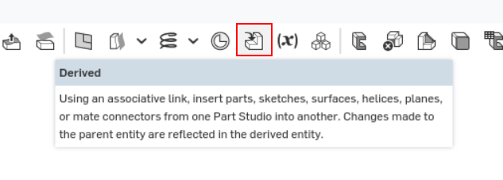
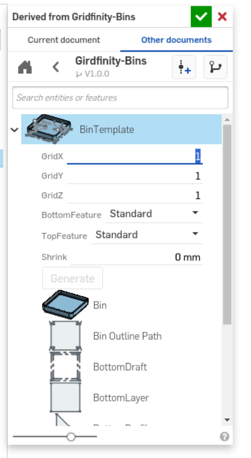

# onshape-gridfinity

## How To use

Create a new Document and add the [Gridfinity-Bins](https://cad.onshape.com/documents/c6af23c0c2996218aff62e73/w/9e1e4a23c40838f552e8dbb6/e/e2cc2e0817e0bca10eba48c9) as derived link

1. Create a new Document
2. add a deriverd link to [Gridfinity-Bins](https://cad.onshape.com/documents/c6af23c0c2996218aff62e73/w/9e1e4a23c40838f552e8dbb6/e/e2cc2e0817e0bca10eba48c9)
   
   

3. Choose BinTemplate for Binsm BaseTemplate for Bases

      

4. Configure your Bin/Base

   

5. Use your new created Bin/Base

## Bin Settings

### GridX

### GridY

### GridZ

### BottomFeature

### TopFeature

### Shrink
      

## Base Settings

### GridX

### GridY

## Changelog

### V1.0.0
